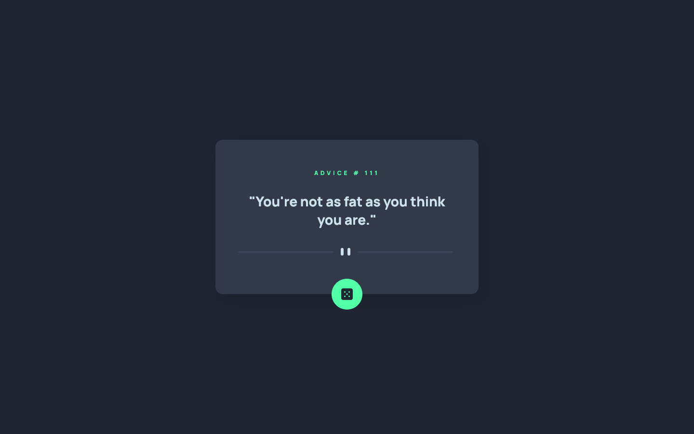
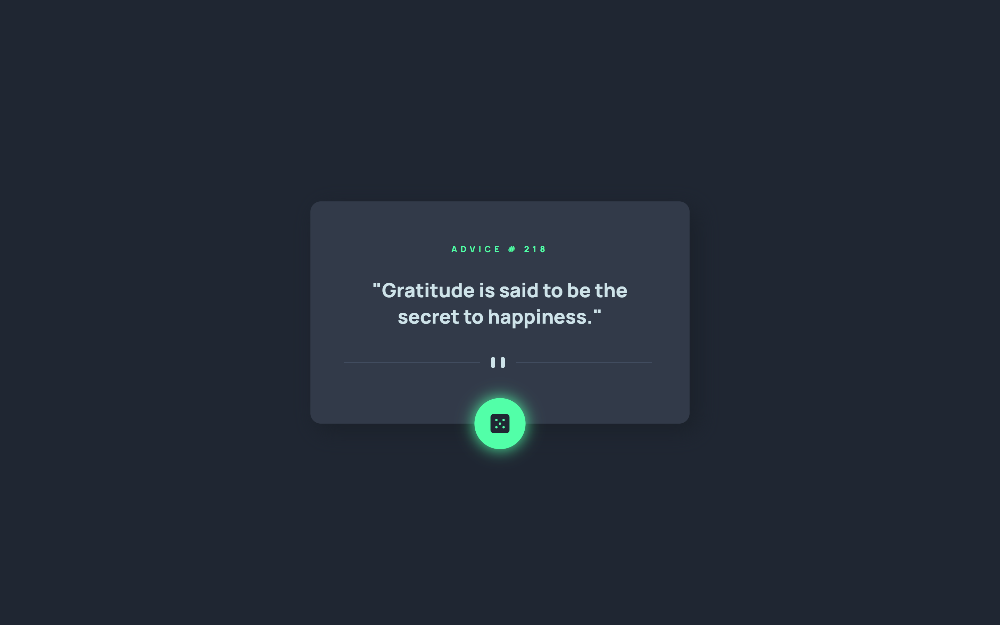
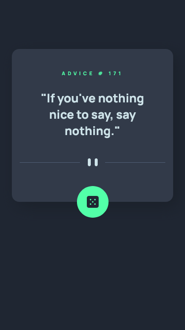

# Frontend Mentor - Advice generator app solution

This is a solution to the [Advice generator app challenge on Frontend Mentor](https://www.frontendmentor.io/challenges/advice-generator-app-QdUG-13db). Frontend Mentor challenges help you improve your coding skills by building realistic projects.

## Table of contents

  - [Screenshot](#screenshot)
  - [Links](#links)
- [My process](#my-process)
  - [Built with](#built-with)
  - [What I learned](#what-i-learned)
  - [Continued development](#continued-development)
  - [Useful resources](#useful-resources)
- [Author](#author)
- [Acknowledgments](#acknowledgments)

### Screenshot





### Links

- Live Site URL: [Vercel](https://advice-generator-app-theta-weld.vercel.app/)

## My process
Pretty much the first thing i built with svelte, so it's not perfect but i learned a lot, also first time hooking api's, which i thought was really scary but svelte makes it really easy. This project was very fun to make, i tried some things with the animations. I might come back to this and try to make an animation of a typewriter when the text loads in. 

### Built with

- Svelte Framework
- Semantic HTML5 markup
- CSS custom properties
- Flexbox
- CSS Grid
- Vite

### What I learned

- Some basic svelte
- Basic knowledge of Svelte Stores
- Reactive svelte functions
- Fetching API's


```js
    {#await promise}
        <span>Loading...</span>
    {:then advice}
        <span>"{advice?.slip.advice}"</span>
    {:catch error}
        <span>{error.message}</span>
    {/await}
```

### Continued development

 - Learn more svelte
 - Use the reactive svelte variable in stylesheet link to make 2 css files, one for dark mode and one for light mode.

### Useful resources

- [Fireship.io](https://fireship.io/courses) - Very good course, taught me basics of Svelte Data Fetching.
- [Svelte Tutorial](https://learn.svelte.dev/tutorial/welcome-to-svelte) - Really well made.


## Author

- Frontend Mentor - [@thegroobi](https://www.frontendmentor.io/profile/thegroobi)
- Twitter - [@thegroobi](https://www.twitter.com/thegroobi)


## Acknowledgments

My gf helped me with animations and chose the one she liked better <3
